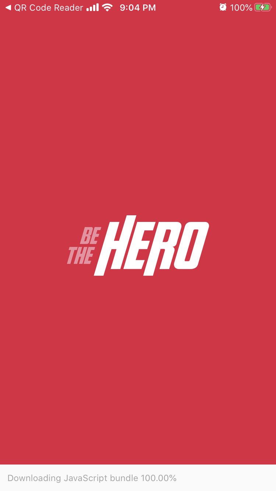
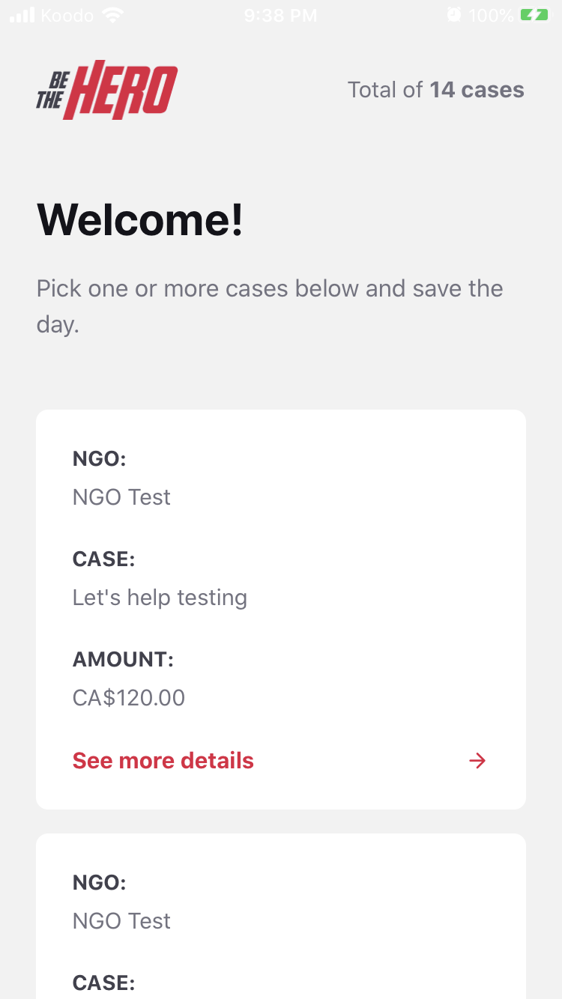
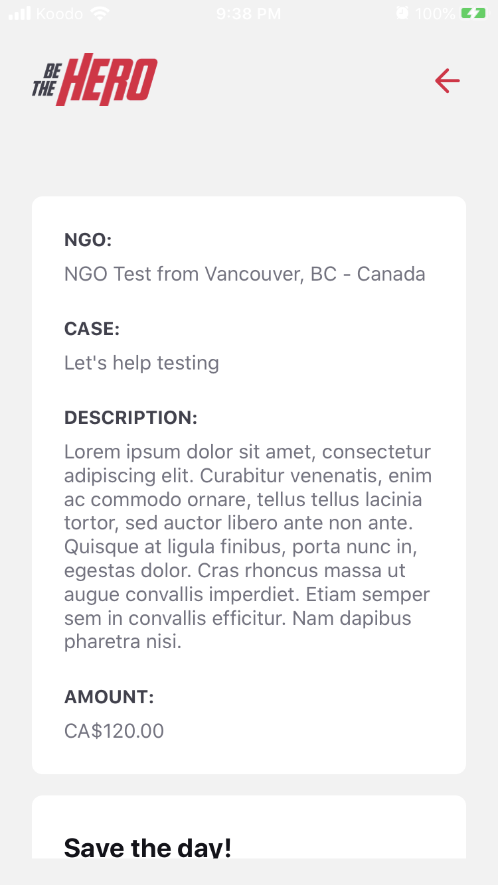
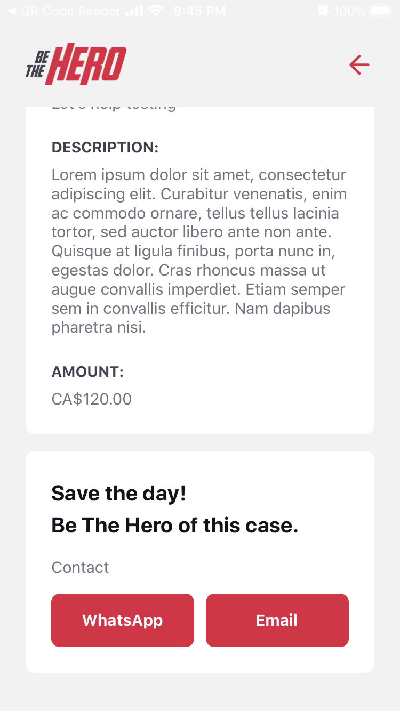
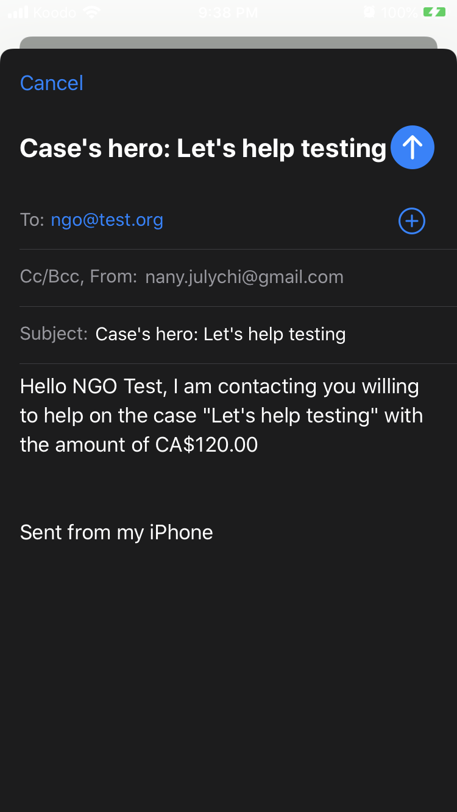
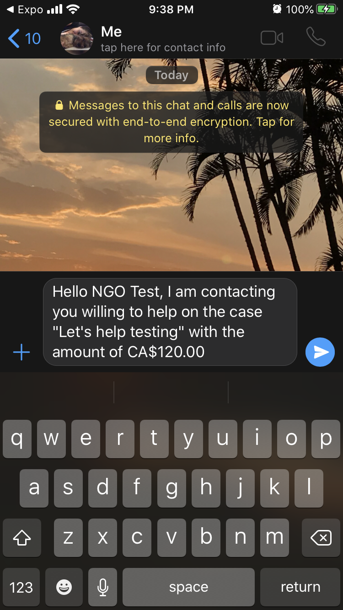

<h1 align="center">
    
</h1>

<h3 align="center">
  Be The Hero Application
</h3>

<h4 align="center"> 
	:construction: 🚀 Project In progress.. :construction:
</h4>

  

  
	
  

  

  

  

  <a href="#rocket-Technologies">Technologies</a>&nbsp;&nbsp;&nbsp;|&nbsp;&nbsp;&nbsp;
  <a href="#-project">Project</a>&nbsp;&nbsp;&nbsp;|&nbsp;&nbsp;&nbsp;
  <a href="#-layout">Layout</a>&nbsp;&nbsp;&nbsp;|&nbsp;&nbsp;&nbsp;
  <a href="#-how-to-contribute">How to contribute</a>&nbsp;&nbsp;&nbsp;|&nbsp;&nbsp;&nbsp;
  <a href="#memo-license">License</a>

 

## :rocket: Technologies

This project was developed with the following technologies:

- [Node.js](https://nodejs.org/en/) 
- [React](https://reactjs.org)
- [React Native](https://facebook.github.io/react-native/) in coming :construction:
- [Expo](https://expo.io/) in coming :construction:

## 💻 Project

Be The Hero is an application created with the purpose of helping Non-Governmental Organizations to share their cases with people around the world.

[Check it out](https://bethehero-schlickmann.netlify.com/)

## 🔖 Layout

|     :---:    |     :---:      |     :---:     |
|   
|   
|     
| 
|    
|  |

## 🤔 How to contribute

- Make a fork;
- Create a branck with your feature: `git checkout -b my-feature`;
- Commit changes: `git commit -m 'feat: My new feature'`;
- Make a push to your branch: `git push origin my-feature`.

After merging your receipt request to done, you can delete a branch from yours.

## :memo: License

This project is under the MIT license. See the [LICENSE](LICENSE) for details.

---

Made with ♥ by Juliani Schlickmann :wave: [Get in touch!](https://www.linkedin.com/in/juliani-schlickmann-damasceno)
